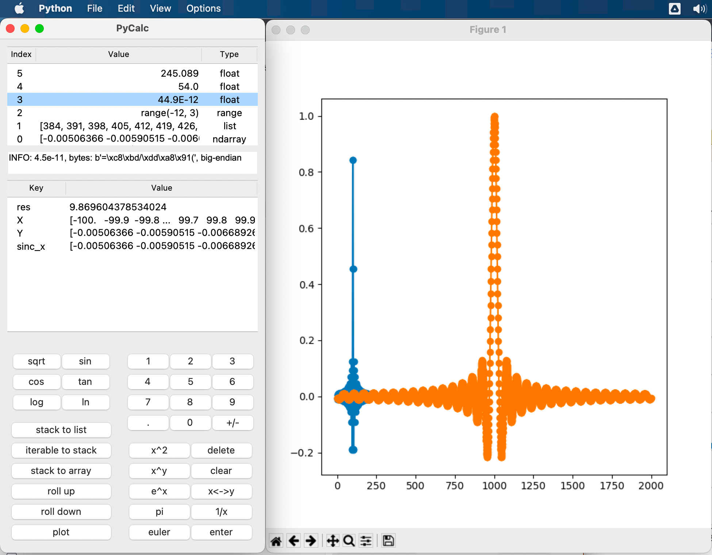
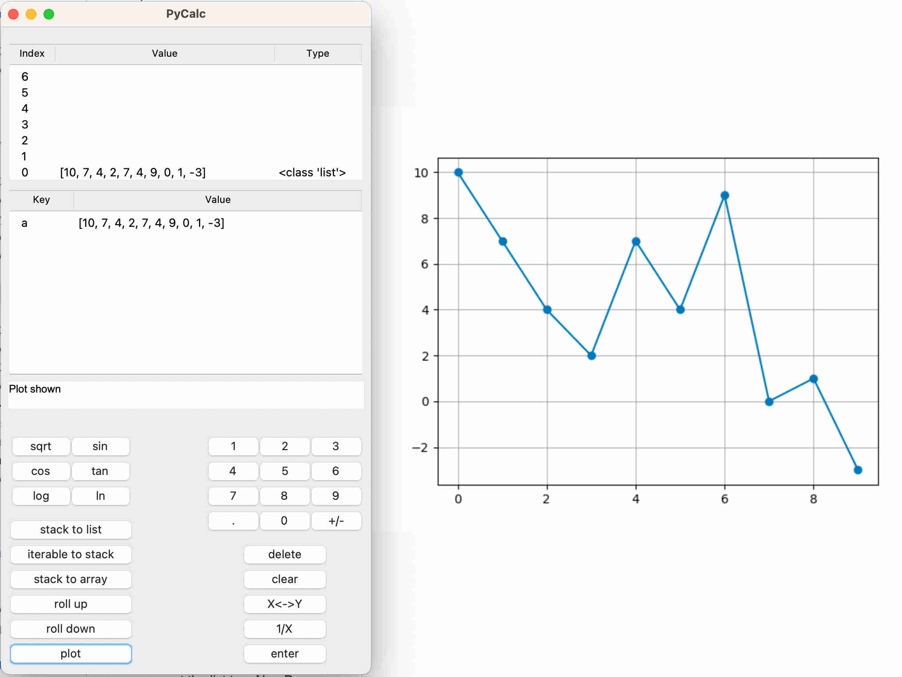
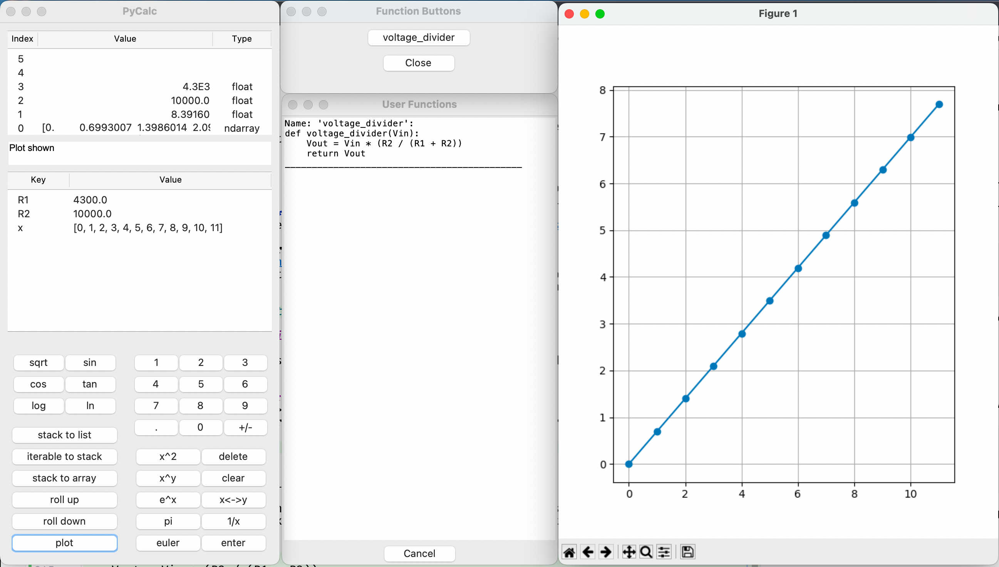
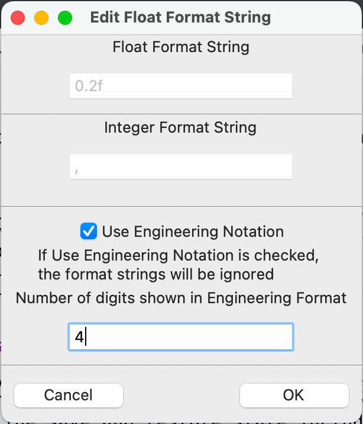
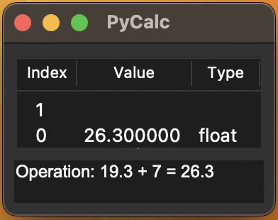

## Hello and welcome to PyCalc, the RPN ~~calculator~~ ~~IDE~~ program that loves Python





_______________________

This is the best calculator you will ever use because it packs the ecosystem of Python 
into a fast and familiar User Interface. 
This project is an experiment to see what happens when you take a Python interpreter, and put an RPN calculator
User Interface wrapper around it. The result is a novel and fast way to interact with Python with the familiarity of a 
calculator UI.
I spent years using Python Terminal, Spyder and now Jupyter Notebooks and while each one has its strengths, 
neither one
offers the simplicity or immediacy of a good old fashion calculator when working math problems. But a traditional 
calculator 
lacks the history and exposition of a Jupyter notebook and the power and massive catalog of tools available in Python. 
Why not incorporate the strengths of all into one App. 
So this project was born and has become a go-to tool for daily engineering math and quick Python scripting.

### Highlights

#### General
- [x] Feature filled RPN calculator with user functions, variables, plotting, and history.
- [x] Novel RPN style interface for interacting with a live Python interpreter
- [x] Built in support for Math, NumPy and Matplotlib libraries 
- [x] Import any Python module and its functions are available for use in the calculator

#### User Interface 
- [x] Customizable Tkinter.ttk User Interface with Stack View, Variable View, and User Function View Window
- [x] Support for copy and pasting between excel and the calculator
- [x] Session history with undo and redo
- [x] Store variables of any type including numbers, arrays, functions, class instances, and more
- [x] Save / Restore sessions and state, by default launches with the last state 
- [x] Dark mode and light mode themes (tracks the system theme)

What makes this program different than other calculators and IDEs is it's ability to interact with Python objects 
in an RPN style stack. For example as shown in the first picture, if you have an ndarray at stack position 0 and an 
integer at stack position 1 you can press * and the calculator will multiply the array by the integer and put the result at
stack position 0.

### Intended Users
- People that want a really powerful calculator 
- Engineers that need to do calculations using saved variables, functions, and libraries 
- Python developers 

### How to install and launch the calculator
As of now the calculator is a Python script that can be run from the command line or your IDE of choice. 
You must have Python installed on your system to run the calculator.

####  Using the UI
1) download the repository
2) from a terminal on mac and linux or power shell on Windows, navigate to the repository directory that contains the main.py file 
3) from a terminal on mac and linux or power shell on Windows, call: `python main.py`
4) This will launch the calculator UI and you can start using it.

### How to use the calculator
At the most basic level, the UI is an RPN calculator so if you know how to use an RPN calculator 
it acts as expected. If RPN is not your thing, you can enter equations as infix notation (like a regular 
calculator) by using parentheses, for example: '(sin(40.2 + pi) + 1.42/24)'. After entering the desired equation 
pushing 'enter' will evaluate the expression and display the result in the stack view and in the message
window. 

#### Quick notes on usage 

1) You don't need buttons to use the math functions.
For example to calculate nCr(5, 3) you can type: 5 **return** 3 **return** ncr **return** and the result will be
displayed on the stack. If you are a speedy typer this method is faster than going back and forth 
between the keyboard and the mouse to enter functions. You can also type out the entire expression, then 
press enter, for example: 'ncr(5, 3)' then **return** to evaluate the same expression. All functions in the Python 
math library are available for use in this way, a reference to the Python Math Library is here: 
https://docs.python.org/3/library/math.html
2) Calculators typically use the notation ln = log base e and log = log base 10. Since this is a 
calculator, it matches the use of ln=log base e and log=log base 10. This means that there is a 
wrapper on the math.log function so calling log(3, 10) throws an error. If you want to call like 
this you must explicitly call: 'math.log(3, 10)' as the builtin log method (for this calculator) is 
always base 10.

__________________________________

### Examples (using the UI)

#### basic math

1) press: **1**
2) press: **enter** -- either on the UI or the keyboard
3) press: **2**
4) press: **+**
5) The result of the operation (1+2) is displayed in the stack view in the X position as *3*

#### using math functions

1) press: **2**
2) press: **enter**
3) press: **log**  -- Note that you can either press the **log** button or type *log* and press enter
4) The result of the operation (log(2)) is displayed in the stack view in the X position as '0.6931471805599453'

#### using variables

1) press: **2**
2) press: **enter**
3) type: *my_var=*
4) press: **enter**
5) The value *2* is stored in the variable *my_var* and is now displayed in the variable view

#### Non RPN style calculations

1) enter: *(1+1)* -- the parentheses lets the calculator know that this is a math expression
2) press: **enter** -- this will evaluate the expression 1+1 and display the result '2' in the stack view


<span style="color:blue">
Note: Any equation can be entered in this way with any variable, for example,  with some value 
assigned to y, try:
(sin(pi)/cos(y) + log(5.3*7)) 
</span>.

#### 

#### Making lists and arrays

This example exposes the underlying power of the calculator to interact directly with the Python interpreter and how
imported Python module's functions can be called directly from the stack to operate on the stack. 

1) enter: *[sin(x/3) for x in range(200)]*
2) press: **enter** -- this will create a list of sin(x/3) for the range x = 0 to x = 199
3) enter: *np.array*
4) press: **enter** -- this will convert the list to a NumPy array and display it in the stack view
5) enter: *tan*
6) press: **enter** -- this is the equivalent of calling np.tan(<array at X>) the calculator loads in all 
7) enter: *a=* 
8) press: **enter** -- this will store the array in the variable **a**
9) enter: *np.mean(a)*
10) press: **enter** -- this will calculate the mean of the array and display the result in the stack view
functions from the NumPy library so you can call them directly from the stack by typing the function name and then 
pressing enter.

<span style="color:blue">
Note: you can copy values in Excel or Google Sheets and paste them directly into the calculator. The calculator 
will convert the pasted section to a list and display it on the stack. 
</span>.

####  Basic Plotting

The Calculator uses the awesome Matplotlib library to plot data. 

1) enter: *[10, 7, 4, 2, 7, 4, 9, 0, 1, -3]*
2) press: **enter** -- this will evaluate the value on the stack to a list type object 
3) press: **plot** -- this will plot the list using matplotlib and display the plot in a new window

<span style="color:blue">
Note: You can copy rows and columns in Excel or Google Sheets and paste them directly into the calculator.
</span>.



#### Even Better Plotting

You can define custom Y, XY, and XYZ plots from the plot menu. After defining list or array variables in the calculator
you will see them 
in the dropdown menu on the plot popups. The length of the list or array will be displayed next to the variable name in 
parentheses. Selecting X and Y variables of the same length will plot the Y variable against the X variable. You can add
multiple plots to the same graph by selecting the 'Add Plot' button. Note that each plot must have a unique trace name
to plot a seperate plot, othewise the existing plot (wiht the trace name) will be overwritten.


#### Advanced Plotting

You can interact directly with the plot library like so: 
1) enter: *np.linspace(0, 10, 100)*
2) press: **enter** -- this will create a NumPy array of 100 points from 0 to 10
3) enter: *np.sin(a/7)*
4)  press: **enter** -- this will create a NumPy array of sin(x/7) for the range x = 0 to x = 10
5) enter: *a=*
6) press: **enter** -- this will store the array in the variable 'a'
7) enter: *np.cos(a/5)* 
8) press: **enter** -- this will create a NumPy array of cos(x/5) for the range x = 0 to x = 10
9) enter: *b=*
10) press: **enter** -- this will store the array in the variable 'b'
11) enter: *plt.plot(a, b, "r-")*
12) press: **enter** -- this will plot the arrays a and b with a red line and display the plot in a new window
13) enter: *plt.show()* -- or press the 'plot' button to directly display the plot in a new window
14) press: **enter** -- this will display the plot in a new window


#### Using Python Libraries

On launch the calculator imports:
```python
import math as math
import numpy as np
import matplotlib.pyplot as plt
```
This means that you can call any function from these libraries directly from the stack. For example:
1) enter: *np.sin([1, 2, 3, 4, 5])*
2) press: **enter** -- this will evaluate the sin function from the NumPy library and display the result in the stack view

For Python libraries that are not imported on launch you can import them directly from the stack. For example:
1) enter: *import random*
2) press: **enter** -- this will import the random library and make all functions from the random library available for use in the calculator
3) enter: *random.randint(1, 100)*
4) press: **enter** -- this will call the randint function from the random library and display the result in the stack view

For methods that require exactly one argument you can call them directly from the stack. For example:
1) enter: *[1, 2, 3, 4, 5]*
2) press: **enter**
3) enter: *random.shuffle*
4) press: **enter** -- this will shuffle the list and display the result in the stack view
For methods that do not require exactly one argument you can call them directly from the stack by typing the method 
name with arguments and then pressing enter. For example:
1) enter: *random.randint(1, 100)*
2) press: **enter** -- this will call the randint function from the random library with the arguments 1 and 100 
and display the result in the stack view

### Working with User Functions

The calculator allows the user to define functions that can be used in the calculator and stored with 
the calculator session.

#### To add a user function:
1) Navigate to  **Options -> Add FUnction**
2) In the dialog that appears, enter the function using the standard Python formatting. For example:
    ```python
    def sqr_x(x):
        return x**2
    ```
3) Press 'OK' and the function will be added to the calculator and will be available for use in the calculator.

A note on user functions: When defining a user function, you can use local variables that are stored to the 
calculator variables. For example to make a function to calculate the output voltage of a resistor divider network 
you can define the function like this:
```python
def voltage_divider(Vin):
    Vout = Vin * (R2 / (R1 + R2))
    return Vout
```
Where **R1** and **R2** are variables that are stored in the calculator (see image below). Best practice is to define 
functions 
such that there is a single passed argument (**Vin** in this case) and the rest of the variables are either defined in the function or as a 
variable in the calculator. This allows you to pass arguments such as numerics or arrays to the user function. 
Additionally, you can navigate to 
**Options** -> **Function Buttons** 
which will open a window that shows all the user functions as buttons. Clicking the button 
will call the function with the current value of the stack X position as the argument.

As an example in the image below, define the user function **voltage_divider** as shown above, then set the variables 
**R1** and
**R2** to some values (see section on assigning variables). 
Define **x** by typing 'np.arange(0,12)' and press **enter**, then type 'x=' then **enter** this will assign the array to the 
variable **x** and put the array in stack position 0. Now navigate to **Options** -> **Function Buttons** and you will see 
the voltage_divider function listed as a button.
Click the button for voltage_divider and it will calculate the output voltage for the array and put the resulting array 
at stack position 0. Now press the **Plot** button and the resulting plot will show the output voltage as shown below.

**Note:** You can also call the function directly from the stack by typing 'voltage_divider(x)' and pressing **enter**.



#### To see all user functions: 
1) navigate to **View -> Show User Functions**

#### To remove a user function:
1) Navigate to **Options -> Remove Function**
2) This will open a popup window with a list of all user functions. Select the function you want to remove 
and press 'Remove'

___________________

### User Options

You can set some options in the calculator by navigating to the 'options' menu. The options are:
- **Save State on Exit** -- Turn this off and the calculator will initialize on launch each time.
- **Edit plot format string** -- This will open a dialog where you can set the format string for plots, for valid strings, 
see Parameters: **fmt** here: https://matplotlib.org/stable/api/_as_gen/matplotlib.pyplot.plot.html

- **Edit numeric display format** -- (see image below) This will open a dialog where you can set the format string for integers, 
see: https://fstring.help/cheat/
 additionally you can select the "Use Engineering Notation" checkbox to use engineering notation for floats. This will 
format the exponent to be a multiple of 3. The "Number of digits shown" is literary the number of digits shown.  



___________________

### View Options
You can navigate to **View** menu to toggle the visibility of the stack, variables, and user functions windows. There 
are two modes, 
- **Standard View** shows all buttons, the message field, the variable viewer and the stack.
- **Mini View** shows only the stack view and reduces the advisable number of stack rows to 2.
- **Show user functions** Opens window that shows all user functions in memory.
- **Show all functions** Opens window shows all imported functions in memory. This list does not include **User Functions**




Mini View shown above with message field and stack view.

___________________

### Saving and Restoring Sessions

The calculator has the ability to save and restore sessions. By default, the calculator will save its state on exit
and load the state on start. The state is saved in the directory where the calculator is run from as 
"last_state_autosave.pycalc". The save and restore state includes the stack, history, variables and calculator settings.

Saving 
1) With some values on the stack and/or in variables press: *ctrl+s* or navigate to the **file** menu and select **save**
2) Select a location and name for the session file and press **save**

Restoring 

3) With the calculator open press: *ctrl+o* or navigate to the file menu and select **open**
4) In the file dialog select the session file and press **open**

__________________

#### Using the API / CLI
1) If you don't want the UI you can use the calc.py module  and instantiate an instance of the Calculator class
and use it like so: 
    
    ```python
   import calc
   c = calc.Calculator()
   ue = c.user_entry
   ue('sin(43.7) + 17.3')
   ue('enter')
   >>> Evaluated: sin(43.7) + 17.3 to 17.0214373937804
   c.return_stack_for_display()
   >>> [17.0214373937804]
    ```
   At this point you can see that the calculator program is intended to have a UI wrapper around it but still works on
the command line. Of note is that the calculator can handle user_entry single chars
at a time so you can also enter 'sin(3)' as:
    ```python
   ... 
    ue('s')
    ue('i')
    ue('n')
    ue('(')
    ue('3')
    ue(')')
    c.enter_press()
   >>> Evaluated: sin(3) to 0.1411200080598672
    ```
This is useful if you want to send user keyboard events directly to the calculator from some other User Interface. For 
example if you already have a snazzy calculator UI and you want to use this calculator backend. I'm looking at you 
flutter and js devs. 

________________________

### Future Features 
- Installer for the UI 
- better array / tensor viewer 

________________________

### If you made it this far

One of the goals I had for this project was to explore the use of Tkinter. I have used various 
other software packages to create UIs and I wanted to give Tkinter a turn. So far tkinter has been fast and easy
to work with. 

It has taken me about twice as long to write this readme as it took to write the code itself, but it is a good 
process because I found a few bugs in doing so. 
